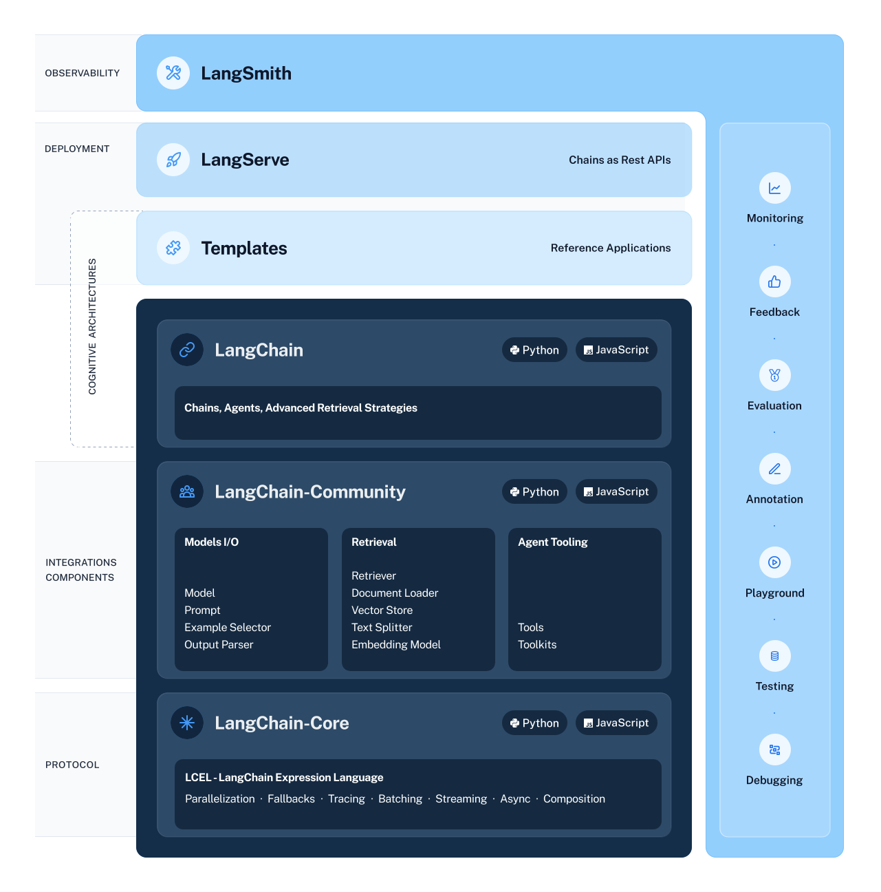

[官网](https://www.langchain.com/)
> Get your LLM application from prototype to production
> Build context-aware, reasoning applications with LangChain’s flexible abstractions and AI-first toolkit.

LangChain-Core 作为核心，Tem
