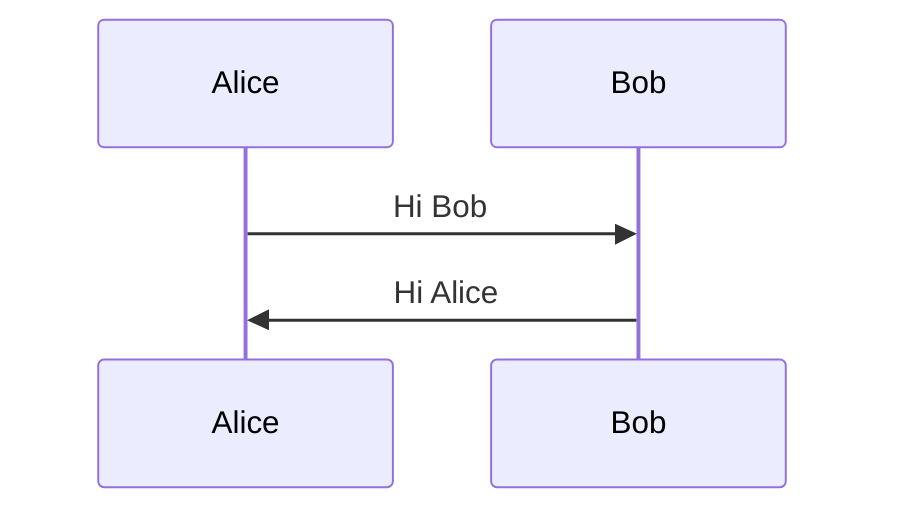
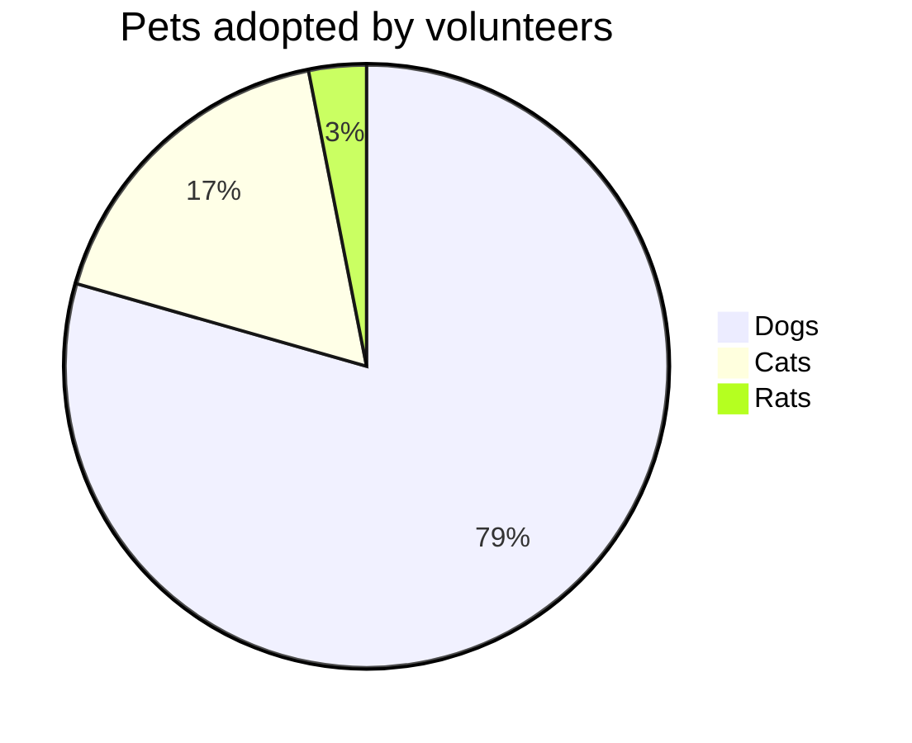
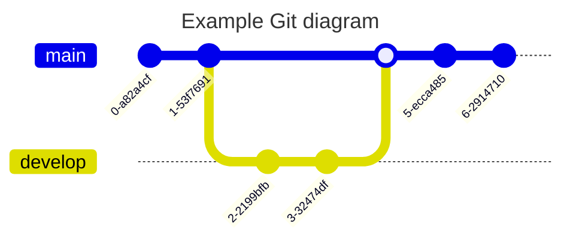
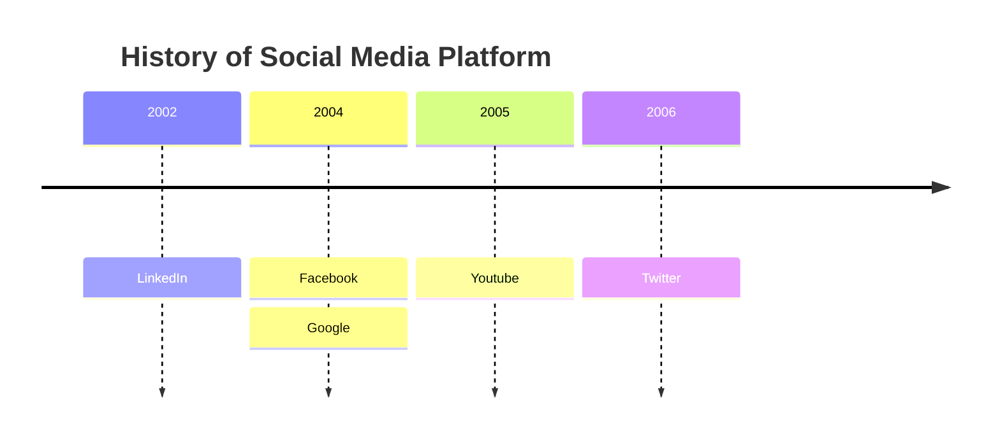

[官网](https://marketplace.visualstudio.com/items?itemName=bierner.markdown-mermaid)

支持 [Mermaid](https://mermaid.js.org/#/) 的流程图及其他图表语法。

```mermaid
sequenceDiagram
    participant Alice
    participant Bob
    Alice->>Bob: Hi Bob
    Bob->>Alice: Hi Alice
```

```mermaid
pie title Pets adopted by volunteers
    "Dogs" : 386
    "Cats" : 85
    "Rats" : 15
```

```mermaid
---
title: Example Git diagram
---
gitGraph
   commit
   commit
   branch develop
   checkout develop
   commit
   commit
   checkout main
   merge develop
   commit
   commit
```

```mermaid
timeline
    title History of Social Media Platform
    2002 : LinkedIn
    2004 : Facebook
         : Google
    2005 : Youtube
    2006 : Twitter
```