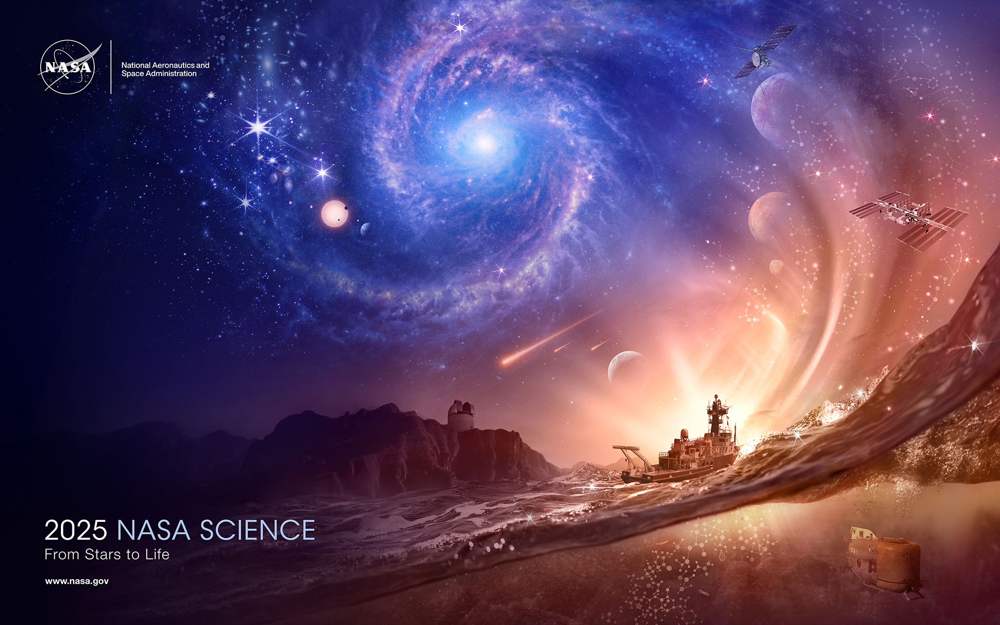

> NASA’s missions are helping us understand life, and its possibilities, near and far.

## 健康
* [BioloGPT](https://biologpt.com/)
* [丁香医生](https://dxy.com/) [疾病风险评估](https://ask.dxy.com/index#/activity-share?activity_id=160)

## 展示
* [每日生活状态](https://claude.site/artifacts/2b936ab6-063d-4e41-b20c-d804d11710b9) [V0 生成的](https://v0.build/K5WWEh9)
* [Stackblitz](https://stackblitz.com/) 展示代码。
* [图之典](http://tuzhidian.com/) 数据可视化。比较，组成，分布，关系，趋势。

## 科普
* 科学
  * [科学的故事：权力、证据与激情](https://zh.wikipedia.org/wiki/%E7%A7%91%E5%AD%B8%E7%9A%84%E6%95%85%E4%BA%8B%EF%BC%9A%E6%AC%8A%E5%8A%9B%E3%80%81%E8%AD%89%E6%93%9A%E8%88%87%E6%BF%80%E6%83%85)
* 宇宙
  * [NASA Science](https://science.nasa.gov/) [Space Place](https://spaceplace.nasa.gov/) [NASA for kids](https://science.nasa.gov/kids/)
* 地理
  * [美国国家地理](https://www.nationalgeographic.com/)
  * [中国国家地理](http://www.dili360.com/)
    * 旗下有杂志 《博物》
  * [wwf](https://www.worldwildlife.org/) World Wildlife Fund
  * [wwf China](https://www.wwfchina.org/work?id=9)
  * 记录片
    * [美丽中国](https://tv.cctv.com/2012/12/10/VIDA1355117645556909.shtml)
* 泛科学
  [果壳](https://www.guokr.com/)
  * [Smithsonia](https://www.si.edu/) The Smithsonian Institution is the world's largest museum, education, and research complex. 
  * [BBC](https://www.bbc.com/)
  * [蝌蚪五线谱](https://www.kedo.net.cn/)

## 资源
* [z library](https://z-lib.io/)

## 小工具
* [计算器](https://v0.build/suxRd03)
