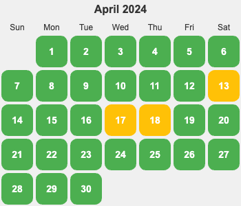

  
概览明细

| 日期  | 跑步 20 分钟(G*1) | 熬夜(B*1)  |
|:----:|:----------------:|:---------:|
|  30  |        1         |     0      |
|  29  |        1         |     0      |
|  28  |        1         |     0      |
|  27  |        1         |     0      |
|  26  |        1         |     0      |
|  25  |        1         |     0      |
|  24  |        1         |     0      |
|  23  |        1         |     0      |
|  22  |        1         |     0      |
|  21  |        1         |     0      |
|  20  |        1         |     0      |
|  19  |        1         |     0      |
|  18  |        0         |     0      |
|  17  |        1         |     1      |
|  16  |        1         |     0      |
|  15  |        1         |     0      |
|  14  |        1         |     0      |
|  13  |        0         |     0      |
|  12  |        1         |     0      |
|  11  |        1         |     0      |
|  10  |        1         |     0      |
|  09  |        1         |     0      |
|  08  |        1         |     0      |
|  07  |        1         |     0      |
|  06  |        1         |     0      |
|  05  |        1         |     0      |
|  04  |        1         |     0      |
|  03  |        1         |     0      |
|  02  |        1         |     0      |
|  01  |        1         |     0      |

跑步状态: 28/30。13日忘记跑步了。18日，没跑，17日冲多邻国的分数睡晚了，18日早上跑不动，晚上睡的早。

## 01日
* 跑步 20 分钟。
* 多邻国 14 个单元。
* 晚上加班吃谷田饭稻，吃撑了，很难受。没注意多点了一份饭，饭又很好吃，吃完了。注意，注意。

## 02日
* 跑步 20 分钟。
* 多邻国 11 个单元。
* 解决问题的核心概念。

## 03
* 跑步 20 分钟。
* 多邻国 10 个单元。
* 多邻国考试考完了，感觉应该比上次的成绩高。单词这块，感觉还是很多不认识。

## 04 清明
* 爬山 整个灵白线。
* 多邻国 11 个单元。

## 05
* 跑步 20 分钟。
* 多邻国 18 个单元。

## 06
* 跑步 20 分钟。
* 多邻国 28 个单元。
* 把课程表做了。

## 07
* 跑步 20 分钟。
* 多邻国 21 个单元。
* 前任 4 英年早婚 有点深度。 婚姻生活中，个人和利益家庭的冲突。一个人被对方看见（重视），很动人：做成的牺牲是值得的。

## 08
* 跑步 20 分钟。
* 多邻国 5 个单元。
* [你想活出怎样的人生](../../../2-society/3-culture/cartoon/works/what-life-do-you-like.md)

## 09
* 跑步 20 分钟。
* 多邻国 17 个单元。
* 从不同角度看问题： [六顶思考帽](../toolbox/content/think-in-different-angles.md)。
* 提炼需求？ 从大量数据中提炼用户的需求。论坛啥的。

## 10
* 跑步 20 分钟。
* 多邻国 11 个单元。坑爹，整个题的章节变了，进度也就变了。难受。跳到了第五大大关。 跳关考试有点难。
学了第五大关的第一单元。
* 抓重点。行业里 重点的人，媒体。
  * [ThoughtWorks 技术雷达](../../../1-self/3-wealth/1-skill/coding/data/thoughtworks-radar.md)

## 11
* 跑步 20 分钟。
* 多邻国 6 个单元。

## 12
* 跑步 20 分钟。
* 多邻国 7 个单元。
* 基于场景的LLM模型能力的基准测试。

## 13
* 多邻国 70 个单元。多邻国变简单了，很多的选择题。
* 忘记跑步了。日程有大变化，因为周日的跆拳道比赛。常规的课改到了上午，下午整个在参加跆拳道。

## 14
* 看 《戏子杀》 的时候运动了 20 分钟。悬疑。唱戏的头牌被各方势力争抢：地头蛇（首富金老板），军阀（方副官），省长。凶手是乱世本身。
* 多邻国很多个单元。 周末一共学了一万左右的经验。总经验已经有4万5了。
* 佛家三法：戒定慧。来解决贪瞋痴。

## 15
* 跑步 20 分钟。
* 多邻国 11 个单元。

## 16
* 跑步 20 分钟。
* 多邻国 12+ 个单元。

## 17
* 跑步 20 分钟。
* 多邻国 12+ 个单元。

## 18
* 多邻国 12+ 个单元。 到 5万经验了。

## 19
* 多邻国 6 个单元。
* 跑步 20 分钟。
* [知识管理](../km/readme.md) 的思考。

## 20
* 多邻国 6 个单元。
* 跑步 20 分钟。从人民桥北边的步道跑到万年桥。
* LLM 产品的分类。
* 看看 a16z, YC 这样的等级的投资公司投了什么公司。
* [对欲望的看法](../mind/desire.md)
* 对 LLM 这块，重点在哪里呢？
* 分析下几个 AI 公众号的关注点

## 21
* 多邻国 6 个单元。
* 跑步 20 分钟。 8 圈。速度提升了一点。跑完 8 圈时，还有一分钟不到的时间，中间还系了两次鞋带。
* 买了飞利浦眼部按摩仪。
* 状态很不好。感觉和跑步累有关系。

## 22
* 多邻国 6 个单元。
* 信息管理的思考。 
  * [优先选择分类还是标签](../../tech/km/contents/prefer-classify-or-tag.md)。
  * 设哪些大分类呢。 分类想清楚了。
* 跑步 20 分钟。 半夜和顾吃完夜宵后跑的。
* 经济下行的时候，情绪价值和娱乐业的消费会上升?

## 23
* 跑步 20 分钟。 
* 多邻国 10 个单元。
* 自定义文件夹在 vscode 中的排序？ 比如 想把 personal 文件夹到最前面，但又不想把文件夹的名字改成 0-personal。  用软链接？ 

## 24
* 跑步 20 分钟。 
* 多邻国 18 个单元。

## 25
* 跑步 20 分钟。
* 多邻国 11 个单元。
* 围绕问题做的信息管理。信息管理为了解决问题。因此，应该基于问题来做信息管理。

## 26
* 跑步 20 分钟。
* 多邻国 2 个单元。

## 27
* 跑步 20 分钟。
* 多邻国 20+ 个单元。

## 28
* 跑步 20 分钟。
* 多邻国 20+ 个单元。 经验 5万5了。
* [《正面管教》](../../product/book/edcation/positive-discipine.md) 读书笔记。

## 29
* 跑步 20 分钟。
* 多邻国 6 个单元。
* 准备试试不吃早饭来提升健康程度。 [《空腹的神奇治愈力》](../../tech/health/food/resource/eat-less.md)

## 30
* 跑步 20 分钟。
* 多邻国 7 个单元。
* 不吃早饭第一天。
