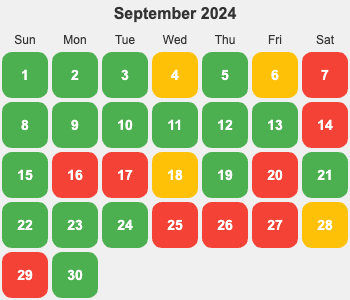

  
概览明细

| 日期  | 有氧运动(如跑步 25 分钟)(G*1) | 每周跑 5 公里(G*4)   | 冥想(G*2) | 吃早饭(B*1)   | 吃夜宵(B*2) | 熬夜(B*5)  |
|:----:|:--------------------------:|:------------------:|:---------:|:-----------:|:-----------:|:---------:|
|  14  |        1                   |         0          |     0     |      0      |      0      |     0     |
|  13  |        1                   |         0          |     1     |      0      |      0      |     0     |
|  12  |        1                   |         0          |     1     |      0      |      0      |     0     |
|  11  |        1                   |         0          |     1     |      0      |      0      |     0     |
|  10  |        1                   |         0          |     1     |      0      |      1      |     0     |
|  09  |        1                   |         1          |     1     |      0      |      0      |     0     |
|  08  |        1                   |         0          |     0     |      0      |      0      |     0     |
|  07  |        1                   |         0          |     0     |      1      |      0      |     1     |
|  06  |        1                   |         0          |     0     |      1      |      0      |     0     |
|  05  |        0                   |         0          |     1     |      1      |      0      |     0     |
|  04  |        1                   |         0          |     0     |      1      |      0      |     0     |
|  03  |        2                   |         0          |     1     |      0      |      0      |     0     |
|  02  |        1                   |         1          |     0     |      0      |      0      |     0     |
|  01  |        1                   |         0          |     1     |      0      |      0      |     0     |

## 概览
* 体力锻炼
  * 跑步 25分钟。完成情况: 13/25+。 
  * 每周跑一次 5 公里。完成总数: 2/4+。未达成周:
* 正念
  * 冥想 15 分钟。完成情况: 8/15+。 
  * 蹲坑不玩手机。剩余次数：1/5-。
* 学习
  * 多邻国: 5+ 个单元。完成情况：10/25+。
* 饮食: 
  * 不吃早饭。完成情况:  4/5-。
  * 不吃夜宵。完成情况:  1/5-。
* 休息: 
  * 不熬夜。11点30(尽量 11:15)之前睡觉。完成情况:  1/5-。
* 信息
  * 05-07 公司团建去嵊泗玩。清水期。住了岛上最好的度假酒店：
    * 华美达(一千多一晚)，整体凑和。
      * 好的地方：
        * 酒店自带内部的沙滩
        * 带泳池
        * 酒店整体装修挺好的。三亚红树林酒店的东南亚度假风。
      * 不好的地方
        * 早餐的丰富程度一般。
        * 设施有点旧。
        * 房间空气不太好。卫生间淋雨旁边积水。
        * 服务不行。接个剪指甲刀没有，看沙滩的大爷，保安很早就赶人。5 点半不能下海，沙滩九点不能有人（8 点 50 就赶人了）
    * 吃了主要是小海鲜：带鱼，鲳鱼，鱿鱼，蛏子，梭子蟹，扇贝，玉秃鱼之类的。
* 其他
  * 做热力图来标识每天的状态。已完成：[每日生活状态](https://claude.site/artifacts/2b936ab6-063d-4e41-b20c-d804d11710b9) 。用 v0 也做了一版。
  * 每天用 GitHub Action 来发自定义的的邮件(https://github.com/marketplace/actions/send-a-mail)。
  * 下个月创新日考虑用 LLM 的能力来自动化根据 Figma 上 UI 做成可用的 UI 组件。

注: 
* 越多越好的目标的记录方式: `达成情况: 当前达成/目标+。`。 要求的完成次数不是很多的不需要未完成日期。
* 越少越好的目标的记录方式: `达成情况: 当前未达成/目标-。`。

## Template
* 运动
  * 跑步: 25 分钟
  * 上斜俯卧撑 30×2; 折刀深蹲 15×2; 坐姿屈膝 15×2
* 正念
  * 冥想 15 分钟。
* 学习
  * 多邻国: x 个单元。
* 信息
* 休息
  * x 睡觉

## 14
* 运动
  * 跑步: 25 分钟
  * 折刀深蹲 15×2;
* 学习
  * 多邻国: 7 个单元。
* 信息
  * 体验 Cursor 的 compose 功能。创建多个文件。
  * 生活场景的架构图
* 休息
  * x 睡觉

## 13
* 运动
  * 跑步: 25 分钟
  * 折刀深蹲 15×4; 上斜俯卧撑 30×2; 
* 正念
  * 冥想 15 分钟。
* 学习
  * 多邻国: 8 个单元。
* 信息
  * 支持在浏览器中跑的向量数据库 https://github.com/askorama/orama
* 休息
  * 11:27 睡觉

## 12
* 运动
  * 跑步: 25 分钟
  * 上斜俯卧撑 30×4; 折刀深蹲 15×4
* 正念
  * 冥想 15 分钟。走神多次，关于 LLM 做 app 的相关思考。
* 学习
  * 多邻国: 7 个单元。
* 信息
  * Nodejs 部署平台[genez](https://app.genez.io/dashboard) 看起来还不错。 [Todo List](https://github.com/Genez-io/genezio-examples/tree/main/typescript/todo-list) 的 Demo。
  * 指定好画布风格来做海报感觉不错 https://claude.ai/chat/1743ca79-9b36-4392-9db7-ff702b733c3f
  * 基于特定网页的工具。以前是油猴这种加 js，css 的，现在是 Monika 这种 ai 驱动的，体验下
* 休息
  * 11:30 睡觉

## 11
* 运动
  * 跑步: 25 分钟
  * 上斜俯卧撑 30×4, 折刀深蹲 15×3; 
* 学习
  * 多邻国: 7 个单元。
* 正念
  * 冥想 15 分钟。
* 信息
  * 部署 AirCode 停止服务了。
* 休息
  * 11:30 睡觉

## 10
* 运动
  * 跑步 25 分钟
  * 上斜俯卧撑 30×3;
* 学习
  * 多邻国: 7 个单元。
* 信息
  * 飞书低代码平台：https://www.feishu.cn/landing/apaas_member_application 。一些 SaaS + 可互通。
* 饮食
  * 吃了夜宵。把鱼干吃完了。
* 休息
  * 11:30 睡觉

## 09
* 运动
  * 跑步: 25 分钟
  * 跑步: 5 公里。还是 32 分钟
  * 上斜俯卧撑 30×2; 坐姿屈膝 15×2
* 正念
  * 冥想 15 分钟。
* 学习
  * 多邻国: 7 个单元。
* 信息
  * 玩了下新版的 v0。比以前的好了不少：主要说对生成网页内容的稳定性有了提升。
* 休息
  * x 睡觉

## 08
* 运动
  * 跑步: 25 分钟
  * 上斜俯卧撑 30×4;
* 学习
  * 多邻国: 7 个单元。
* 休息
  * 11:30 睡觉

## 07
* 运动
  * 跑步: 25 分钟
* 学习
  * 多邻国: 7 个单元。
* 信息
  * 第一次吃玉秃鱼
* 休息
  * 11:50 睡觉

## 06
* 运动
  * 动感单车: 25 分钟。酒店的
  * 上斜俯卧撑 30×4;
* 学习
  * 多邻国: 8 个单元。
* 休息
  * 11:10 睡觉
* 信息
  * 玩了下桌游：《Scout！马戏星探》 挖角和演出。

## 05
* 运动
  * 上斜俯卧撑 30×2; 斜到床边沿的俯卧撑 15×4; 坐姿屈膝 15×1
* 正念
  * 冥想 15 分钟。忘记走神几次了，前面走神多，后面很沉静。
* 学习
  * 多邻国: 7 个单元。
* 饮食
  * 酒店早饭。
* 信息
  * 试了 shotgun 一罐啤酒。五秒左右喝完一罐。
* 休息: 
  * 11:28 睡觉

## 04
* 运动
  * 跑步: 25 分钟
  * 上斜俯卧撑 30×2
* 学习
  * 多邻国: 7 个单元。
* 饮食: 
  * 早上吃了。全家的山芋。
* 信息
  * 单纯的人际交往之中，与其不高明地固执己见，还不如老实地道歉，或许能让事情的进展更加顺利。 - 《这一切纯属偶然》 伊坂幸太郎
* 休息: 
  * 11:15 睡觉

## 03
* 运动
  * 跑步: 25 分钟 * 2 。早晚各一次。
  * 上斜俯卧撑 30×2
* 正念
  * 冥想 15 分钟。走神了 17 次。
* 学习
  * 多邻国: 7 个单元。
* 信息:
  * 将该项目构建的服务抽离出来了：https://github.com/iamjoel/dialogue-view-service
* 休息: 
  * 11:28 睡觉

五戒不：杀、不盗、不淫、不妄语，也不饮用酒精或任何可令他们昏乱的刺激品。

## 02
* 运动
  * 跑步: 25 分钟
  * 跑步了 5 公里。继续 32 分钟。
  * 上斜俯卧撑 30×2
* 学习
  * 多邻国: 7 个单元。
* 休息: 
  * 11:29 睡觉

## 01
* 运动
  * 跑步: 25 分钟
  * 上斜俯卧撑 30×4
* 正念
  * 冥想 12 分钟。10 次走神。最后被其他事打断了。
* 学习
  * 多邻国: 7 个单元。
* 休息: 
  * 11:30 睡觉
