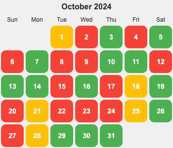

## TODO
1. personal 重构内容的组织(问题是：内容的关系不够清晰)。特别是SOP 结构梳理。
2. 重塑大脑和佛陀那书整理玩。
3. 导航会有散的问题。将生活拆成一个个场景，用场景来组织导航是不是会比较好。
4. 思考: 如何能写出有赚钱能力的文章。
5. 让 AI 来做学习技术，技术选型，review 代码，重构代码，面试， 等技术辅助的事

  
概览明细

| 日期  | 有氧运动(G*1) | 每周跑 5 公里(G*4)   | 冥想(G*2) | 吃早饭(B*1)   | 吃夜宵(B*2) | 熬夜(B*5)  |
|:----:|:------------:|:------------------:|:---------:|:-----------:|:-----------:|:---------:|
|  18  |      0       |         0          |     0     |      0      |      0      |     0     |
|  17  |      1       |         0          |     0     |      1      |      1      |     1     |
|  16  |      0       |         1          |     0     |      1      |      0      |     0     |
|  15  |      1       |         0          |     0     |      1      |      0      |     1     |
|  14  |      1       |         0          |     0     |      0      |      0      |     0     |
|  13  |      0       |         1          |     0     |      1      |      0      |     0     |
|  12  |      1       |         0          |     0     |      0      |      0      |     1     |
|  11  |      1       |         0          |     1     |      0      |      0      |     0     |
|  10  |      1       |         0          |     0     |      0      |      0      |     0     |
|  09  |      0       |         1          |     0     |      0      |      0      |     1     |
|  08  |      1       |         0          |     0     |      0      |      0      |     1     |
|  07  |      1       |         0          |     0     |      0      |      0      |     0     |
|  06  |      0       |         1          |     0     |      0      |      0      |     1     |
|  05  |      1       |         0          |     0     |      0      |      0      |     0     |
|  04  |      0       |         0          |     0     |      0      |      1      |     1     |
|  03  |      1       |         0          |     0     |      0      |      0      |     0     |
|  02  |      1       |         0          |     0     |      1      |      1      |     0     |
|  01  |      1       |         0          |     0     |      1      |      0      |     0     |

## 概览
* 体力锻炼
  * 跑步 25分钟。完成情况: 12/25+。 
  * 每周跑一次 5 公里。完成总数: 4/4+。
* 正念
  * 冥想 15 分钟。完成情况: 1/15+。 
  * 蹲坑不玩手机。剩余次数: 1/5-。
* 学习
  * 多邻国: 5+ 个单元。完成情况: 13/25+。
* 饮食: 
  * 不吃早饭。完成情况: 3/5-。
  * 不吃夜宵。完成情况: 2/5-。
* 休息: 
  * 8 小时睡眠。11点30(尽量 11:00)之前睡觉。完成情况:  7/5-。

## Template
* 运动
  * 跑步: 25 分钟
  * 上斜俯卧撑 30×3; 折刀深蹲 20×3; 坐姿屈膝 15×2
* 正念
  * 冥想 15 分钟。
* 学习
  * 多邻国: 7 个单元。
* 信息
* 休息
  * x 睡觉

</detail>

## 18
* 学习
  * 多邻国: 8 个单元。
* 信息
* 休息
  * x 睡觉

## 17
* 运动
  * 跑步 25 分钟
  * 上斜俯卧撑 30×3; 
* 学习
  * 多邻国: 7 个单元。
* 饮食
  * 晚上吃了 2 个芝麻饼。
* 休息
  * 1:16 睡觉。看《不同照背照样学好中国史》，作者写《哲学家们都干了些什么的》。

## 16
* 运动
  * 跑步 5 公里。 29 分钟。平均配速在 5 分 30。
* 学习
  * 多邻国: 7 个单元。
* 信息
* 休息
  * 11:30 睡觉

## 15
* 运动
  * 跑步: 25 分钟
* 学习
  * 多邻国: 5 个单元。
* 饮食
  * 吃了早饭。
* 信息
* 休息
  * 1:35 睡觉。在家办公，参加家长会，晚上做的晚了，然后放松了下~

## 14
* 运动
  * 跑步: 25 分钟
  * 上斜俯卧撑 30×6; 坐姿屈膝 15×1
* 学习
  * 多邻国: 7 个单元。
* 信息
* 休息
  * 11:30 睡觉

## 13
* 运动
  * 护城河跑 28 分钟,5 公里。 用 APP 咕咚 算的。
  * 折刀深蹲 20×3;
* 学习
  * 多邻国: 7 个单元。
* 饮食
  * 早饭吃了红油抄手。没有生菜的版本。
* 休息
  * 11:27 睡觉

## 12
* 运动
  * 跑步: 25 分钟
  * 上斜俯卧撑 30×3; 
* 学习
  * 多邻国: 7 个单元。
* 信息
  * Openai 开源的 Agent 框架 [Swarm](https://github.com/openai/swarm)。
  * Langchain 的 [langgraphjs](https://github.com/langchain-ai/langgraphjs)
* 休息
  * 12:45 睡。等 refresh 的 review 。以及看了一个白屏的 bug。

## 11
* 运动
  * 跑步: 25 分钟
* 正念
  * 冥想 15 分钟。
* 学习
  * 多邻国: 10 个单元。
* 信息
  * 前端的本质，数据和 UI
  * 优化了下手机 UI，很舒服: 换了壁纸，不显示 app 名字，用设计师 app ico
* 休息
  * 11:12 睡觉

## 10
* 运动
  * 跑步: 25 分钟
* 学习
  * 多邻国: 7 个单元。
* 信息
* 休息
  * 11:30 睡觉

## 09
* 运动
  * 跑 5 公里。28 分钟。
  * 折刀深蹲 20×3;
* 学习
  * 多邻国: 7 个单元。
* 信息
* 休息
  * 12:05 睡。刷推忍不住看看看。一没看到啥有价值的。以后多有搜索（目的），而不是浏览。

## 08
* 运动
  * 跑步: 25 分钟
  * 上斜俯卧撑 30×6;  坐姿屈膝 15×1
* 学习
  * 多邻国: 9 个单元。
* 信息
  * https://github.com/PatrickJS/awesome-cursorrules
  * notebookLLM 的开源平替：https://github.com/gabrielchua/open-notebooklm
* 休息
  * 11:55 睡

## 07
* 运动
  * 跑步: 25 分钟
  * 折刀深蹲 20×3;
* 学习
  * 多邻国: 7 个单元。
* 信息
* 休息
  * 11:21 睡觉

## 06
* 运动
  * 跑步: 30 分钟。在体育馆跑的。
  * 上斜俯卧撑 30×3;
* 学习
  * 多邻国: 8 个单元。
* 信息
* 休息
  * 02:15 睡。栗子吃太多了，肚子不舒服，遛弯。

## 05
* 运动
  * 跑步: 25 分钟
  * 折刀深蹲 20×3; 
* 学习
  * 多邻国: 7 个单元。
* 信息
* 休息
  * 10:20 睡觉

## 04
去三国城，水浒城玩了。

* 学习
  * 多邻国: 1 个单元。 
* 饮食
  * 吃了夜宵。到家吃了 KFC。
* 休息
  * 03:30 睡。 把 犯罪悬疑剧《她和她的他们》看完了。太多为了制造谜团硬造的巧合了。像味道太重（比如香辣）的食物。对人的诱惑太大，容易熬夜。

## 03
* 运动
  * 跑步: 25 分钟
  * 上斜俯卧撑 30×5;
* 学习
  * 多邻国: 8 个单元。
* 休息
  * 11:29 睡觉

## 02
* 运动
  * 爬宜兴竹海的山，海拔 610 米。 8 点出发，晚上 9 点到家。
* 学习
  * 多邻国: 1 个单元。
* 饮食
  * 早上吃了点坚果。
  * 晚上到家吃了泡面。玩景区的不规律。
* 休息
  * 11:10 睡觉

## 01 国庆节
* 运动
  * 跑步: 25 分钟
  * 折刀深蹲 20×3;
* 学习
  * 多邻国: 7 个单元。
* 休息
  * 11:28 睡觉
