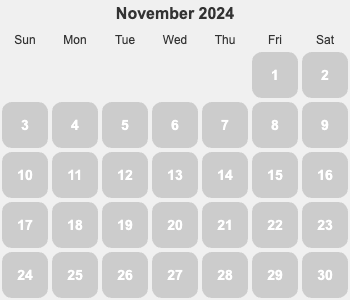

## TODO
1. personal 重构内容的组织(问题是：内容的关系不够清晰)。特别是SOP 结构梳理。
2. 重塑大脑和佛陀那书整理玩。
3. 导航会有散的问题。将生活拆成一个个场景，用场景来组织导航是不是会比较好。
4. 思考: 如何能写出有赚钱能力的文章。
5. 让 AI 来做学习技术，技术选型，review 代码，重构代码，面试， 等技术辅助的事
6. 开始有趣的讲历史。把虚拟人物代入到历史中来写。

  
概览明细

| 日期  | 体力锻炼(G*2) |  冥想(G*2) | 吃早饭(B*1)  | 吃夜宵(B*2)  | 熬夜(B*3)  |
|:----:|:------------:|:---------:|:-----------:|:------------:|:---------:|
|  04  |      1       |     0     |      0      |      0       |     0     |
|  03  |      1       |     0     |      1      |      1       |     1     |
|  02  |      1       |     0     |      0      |      0       |     0     |
|  01  |      0       |     0     |      0      |      0       |     0     |

## 概览
* 体力锻炼
  * 跑步。跑步机 25 分钟+。完成情况: 1/5-。 
  * 每周跑 10 公里+。完成总数: 1/4+。
* 正念
  * 冥想 15 分钟。完成情况: 0/15+。 
  * 蹲坑不玩手机。剩余次数: 0/5-。
* 学习
  * 多邻国: 5+ 个单元。完成情况: 0/25+。
* 饮食: 
  * 不吃早饭。完成情况: 1/5-。
  * 不吃夜宵。完成情况: 1/5-。
* 休息: 
  * 不熬夜。11点30(尽量 11:15)之前睡觉。完成情况:  1/5-。

## Template
* 运动
  * 跑步: 25 分钟
  * 上斜俯卧撑 30×3; 折刀深蹲 20×3; 坐姿屈膝 15×2
* 正念
  * 冥想 15 分钟。
* 学习
  * 多邻国: 7 个单元。
* 信息
* 休息
  * x 睡觉

</detail>

## 05
* 运动
  * 跑步: 30 分钟
  * 上斜俯卧撑 30×3;;
* 学习
  * 多邻国: 7 个单元。
* 休息
  * x 睡觉

## 04
* 运动
  * 跑步: 30 分钟
  * 折刀深蹲 20×3;
* 学习
  * 多邻国: 8 个单元。
* 饮食
  * 吃了早饭，三期门口的甜筒，冰饭。
* 休息
  * 11:30 睡觉

## 03
* 运动
  * 跑步: 6 公里。慢跑。
* 学习
  * 多邻国: 7 个单元。
* 饮食
  * 早上吃了个玉米。
* 休息
  * 12:25 睡。

## 02
* 运动
  * 跑步: 10 公里，55 分钟。
  * 上斜俯卧撑 30×3; 折刀深蹲 20×3; 坐姿屈膝 15×2
* 正念
  * 冥想 15 分钟。
* 学习
  * 多邻国: 7 个单元。
* 休息
  * 11:30 休息

## 01
* 学习
  * 多邻国: 6 个单元。
  * 上斜俯卧撑 30×5; 
* 休息
  * 11:28 睡觉

