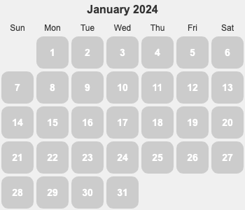
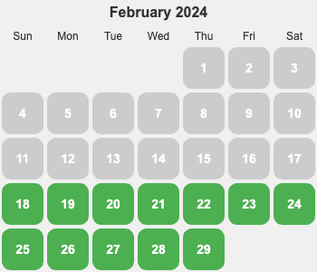
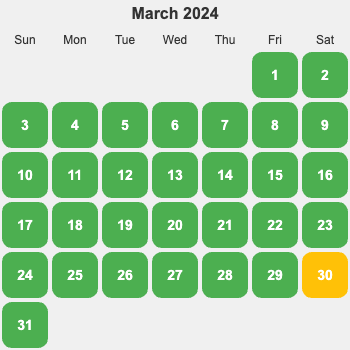
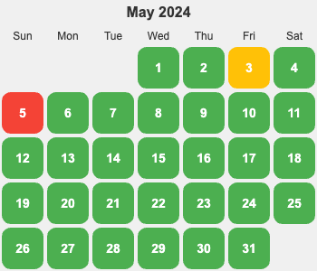
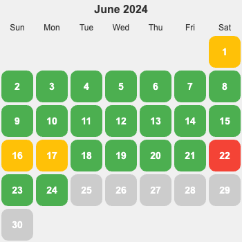
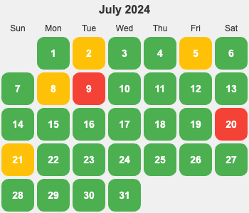
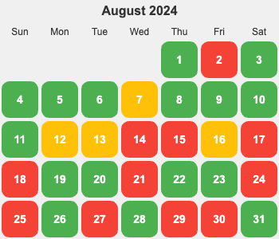

  
  
  
  

  
  
  
  

  

## 状态
* 运动
  * 有氧：32 分钟跑 5 公里。
  * 力量：上斜俯卧撑(第二式) 30×2; 折刀深蹲(第二式) 15×2; 举腿(第一式) 15×2。 具体见《囚徒健身》。
  * 柔韧/平衡：弯腰摸底手能勉强够地。
* 正念
  * 冥想 15 分钟。
  * 上厕所，吃饭不看手机。

## 思考
* 对自己的定位。重点做的东西，展示的东西。

## 其他
* [场景](./scence.md)
* [灵感](./inspiration.md)
* [每天一个有趣的](./fun.md)
