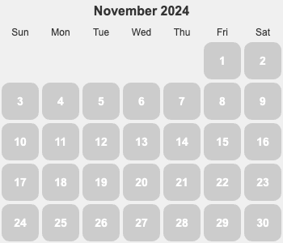

  
  
  
  

  
  
  
  

  
  
  
  

## 状态
* 运动。从 2 月年后开始跑。从开始的只能跑 3 公里 到能跑 10 公里以上。 静息心率：50。
  * 有氧： 大于 6公里的配速跑 10 公里。单跑 1 公里的最高配速： 4 分 37 秒。
    * 11/02， 10 公里 55:39 分钟， 5 公里 26: 59。
    * 10/27， 极速配速 4 分 38 秒。
  * 力量：上斜俯卧撑(第二式) 30×3; 折刀深蹲(第二式) 20×3; 举腿(第一式) 15×2。 具体见《囚徒健身》。
  * 柔韧/平衡：弯腰摸底手能勉强够地。
* 正念
  * 冥想 15 分钟。
  * 上厕所，吃饭不看手机。

## 思考
* 对自己的定位。重点做的东西，展示的东西。

## 其他
* [场景](./scence.md)
* [输入](./in.md) & [输出](./out.md)
* [灵感](./inspiration.md)
* [每天一个有趣的](./fun.md)
