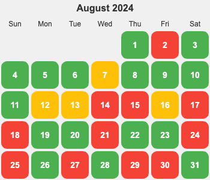

  

  
概览明细

| 日期  | 跑步 20 分钟(G*1) | 每周跑 5 公里(G*4)   | 冥想(G*2) | 吃早饭(B*1)   | 吃夜宵(B*2) | 熬夜(B*5)  |
|:----:|:----------------:|:------------------:|:---------:|:-----------:|:-----------:|:---------:|
|  31  |        1         |         0          |     1     |      0      |      0      |     0     |
|  30  |        0         |         0          |     0     |      1      |      0      |     1     |
|  29  |        1         |         0          |     0     |      0      |      1      |     1     |
|  28  |        1         |         0          |     1     |      0      |      0      |     0     |
|  27  |        1         |         0          |     0     |      0      |      0      |     1     |
|  26  |        0         |         1          |     1     |      0      |      0      |     1     |
|  25  |        0         |         0          |     1     |      0      |      0      |     1     |
|  24  |        1         |         0          |     0     |      0      |      0      |     1     |
|  23  |        1         |         0          |     0     |      0      |      0      |     0     |
|  22  |        1         |         0          |     1     |      1      |      0      |     0     |
|  21  |        1         |         0          |     0     |      0      |      0      |     1     |
|  20  |        1         |         0          |     0     |      0      |      0      |     0     |
|  19  |        1         |         0          |     0     |      0      |      0      |     0     |
|  18  |        0         |         0          |     0     |      0      |      0      |     1     |
|  17  |        0         |         0          |     0     |      1      |      0      |     0     |
|  16  |        0         |         0          |     0     |      0      |      0      |     0     |
|  15  |        0         |         0          |     0     |      0      |      0      |     1     |
|  14  |        0         |         0          |     0     |      0      |      0      |     1     |
|  13  |        0         |         0          |     0     |      0      |      0      |     0     |
|  12  |        1         |         0          |     0     |      1      |      0      |     0     |
|  11  |        1         |         0          |     1     |      0      |      0      |     0     |
|  10  |        1         |         0          |     0     |      0      |      0      |     0     |
|  09  |        1         |         0          |     0     |      0      |      0      |     0     |
|  08  |        1         |         0          |     0     |      0      |      0      |     0     |
|  07  |        1         |         1          |     0     |      0      |      0      |     1     |
|  06  |        1         |         0          |     0     |      0      |      0      |     0     |
|  05  |        1         |         0          |     0     |      0      |      0      |     0     |
|  04  |        1         |         0          |     0     |      0      |      0      |     0     |
|  03  |        1         |         0          |     1     |      0      |      0      |     0     |
|  02  |        1         |         0          |     0     |      0      |      1      |     1     |
|  01  |        1         |         0          |     0     |      0      |      0      |     0     |

## 概览
* 体力锻炼
  * 跑步每天 20分钟: 达成率：23/31。 未达成(8)：13,14,15,16,17,18,25,30。
  * 每周跑一次 5 公里(本月第二周开始的): 达成率: 03/04。
* 脑力锻炼
  * 多邻国: 5 个单元+。达成率： 31/31。
  * 冥想：9次。
* 饮食: 
  * 不吃早饭。达成率： 21/31。未达成(10)：04, 08, 11, 16, 17, 18, 19, 24, 30, 31。
  * 不吃夜宵。达成率： 25/31。未达成(6)：03, 12, 18, 24, 25，30。
* 休息: 不熬夜。11点30之前睡觉。达成率：20/31。未达成(11)： 02, 07, 14, 15, 18, 21, 24, 25, 26, 27，30。
* 日常提升:
  * 做一个管理日常操作的 app。目前用 markdown 没法做到实际和目标的差距。行为，次数，备注。两大模块： 计划，执行。

## Template
* 体力锻炼
  * 跑步: 25 分钟
  * 腹式呼吸
  * 上斜俯卧撑 30×2
  * 倒立深蹲 35×2
  * 垂直引体 30×2
  * 坐姿屈膝 15×2
* 脑力锻炼
  * 多邻国: x 个单元。
  * 冥想 15 分钟。走神了 x 次。
* 信息: 
  * 
* 休息: 
  * x 睡觉

## 31
* 体力锻炼
  * 跑步: 25 分钟
  * 上斜俯卧撑 30×6
  * 倒立深蹲 30×2
  * 坐姿屈膝 15×2
* 脑力锻炼
  * 多邻国: 9 个单元。
  * 冥想 15 分钟。走神了 16 次。
* 饮食: 
  * 吃早饭了。
* 休息: 
  * 11:30 睡觉

## 30
* 体力锻炼
* 脑力锻炼
  * 多邻国: 8 个单元。
* 饮食: 
  * 吃了早饭。晚上吃了夜宵后，容易想吃早饭。
* 休息: 
  * 12:55 睡觉。和团子散步，回来十一点多了，就没有跑步。删微信的聊天会话。

## 29
* 体力锻炼
  * 跑步: 25 分钟
  * 上斜俯卧撑 30×5
  * 坐姿屈膝 15×2
* 脑力锻炼
  * 多邻国: 7 个单元。
  * 冥想 15 分钟
* 饮食: 
  * 吃了夜宵。
* 休息: 
  * 2:25 睡觉。想多看会剧的渴望。。。

## 28
* 体力锻炼
  * 跑步: 25 分钟
  * 上斜俯卧撑 30×4
  * 坐姿屈膝 15×2
* 脑力锻炼
  * 多邻国: 8 个单元。
  * 冥想 15 分钟
* 信息: 
  * [人为什么容易有消极情绪](../../tech/health/base/mood/why-tend-to-have-nagative-mood.md)
* 休息: 
  * 11:28 睡觉

## 27
* 体力锻炼
  * 跑步 25 分钟
  * 上斜俯卧撑 30×4
  * 坐姿屈膝 15×2
* 脑力锻炼
  * 多邻国: 7 个单元。
* 信息: 
  * 继续做减少信息干扰，简化的事。一步到高频的 app，tools...。
  * Chrome 的新功能。
    1. 支持网页上的图片来搜索。
    2. 直接在使用 Gemini。
* 休息: 
  * 12:27 睡。和九哥聊了分销商城的选择。

## 26
* 体力锻炼
  * 跑步: 5 公里。32 分钟
* 脑力锻炼
  * 多邻国: 7 个单元。
  * 冥想: 15 分钟。
* 信息: 
  * 把几个微信里有 App 删除了。
  * 专注在当下，也是一种正念
* 休息: 
  * 11:33 睡觉。因为冥想超过了一点点。今天控制力不错，也没吃夜宵，以及太晚睡，还冥想了。

## 25
* 体力锻炼
  * 上斜俯卧撑 30×3
  * 垂直引体 15×2
  * 坐姿屈膝 15×2。感觉没那么累，是核心力量变强了吗。
* 脑力锻炼
  * 多邻国: 8 个单元。
  * 冥想: 15 分钟
* 饮食 
  * 晚上吃了坚果，麦丽素
* 休息: 
  * 12:30 睡觉。放肆的周末。

## 24
* 体力锻炼
  * 跑步: 20 分钟
  * 游泳 300 米。很累。
* 脑力锻炼
  * 多邻国: 7 个单元。
  * 冥想 15 分钟
* 饮食
  * 早上吃了麻薯。
  * 吃了夜宵。晚上逛了逛，买了土豆饼和一些坚果。
* 休息: 
  * 2 点 10 分睡。 

## 23
* 体力锻炼
  * 跑步: 20 分钟
  * 上斜俯卧撑 30×3
* 脑力锻炼
  * 多邻国: 9 个单元。经验过 10 万～
* 信息: 
  * 火山引擎的 HiAgent
* 休息: 
  * 11:24 睡觉

## 22
* 体力锻炼
  * 跑步: 20 分钟
  * 上斜俯卧撑 30×2
* 脑力锻炼
  * 多邻国: 8 个单元。
  * 冥想 15 分钟
* 饮食: 
  * 吃了早饭。饭团。昨天跑步，晚睡影响的。。。
* 休息: 
  * 11:30 睡觉

## 21
* 体力锻炼
  * 跑步: 20 分钟
  * 晚上跑 5 公里。将近 32 分钟。
* 脑力锻炼
  * 多邻国: 8 个单元。
* 休息: 
  * 02:15 睡。吃了坚果等零食。本来感觉可以控制住正常睡觉和不吃的，但因为洗衣服结束过正常时间，所以失控了。下次不会。

## 20
* 体力锻炼
  * 跑步: 20 分钟
  * 上斜俯卧撑 30×2
* 脑力锻炼
  * 多邻国: 7 个单元。
* 信息
  * 《黑神话》上线，Steam 周销售冠军。国内的第一个 3A 游戏，开发了 7 年。预测销量有望达到 500 - 700 万套。
* 休息: 
  * 11:30 睡觉

## 19
* 体力锻炼
  * 跑步: 25 分钟。酣畅淋漓～
* 脑力锻炼
  * 多邻国: 7 个单元。
* 信息: 
  * Think out of box. 5 美元的故事。
* 休息: 
  * 11:30 睡觉

## 18
* 脑力锻炼
  * 多邻国: 5 个单元。
* 饮食: 
  * 吃了早饭。酒店早饭。吃了夜宵。吃了点面包，菠萝啥的。
* 休息: 
  * 12:47 睡觉。洗了一堆衣服，挖沙工具啥的。

## 17
* 脑力锻炼
  * 多邻国: 7 个单元。
* 饮食: 
  * 吃了早饭。早上开车去酒店，不知道什么时候能吃到午饭。
* 休息: 
  * 11:00 睡觉 。启东希尔顿花园酒店（希尔顿的中端品牌，四星级）。

## 16
* 体力锻炼
  * 无。恢复
* 饮食: 
  * 吃了早饭。恢复。。。
* 脑力锻炼
  * 多邻国: 8 个单元。
* 休息
  * 11:30 睡。

## 15
* 体力锻炼
  * 无。请假在家休息。
* 脑力锻炼
  * 多邻国: 5 个单元。
* 休息
  * 12:31 睡。不太想睡，可能是白天睡得一点多。早上和中午。

## 14
* 体力锻炼
  * 无。请假在家休息。
* 脑力锻炼
  * 多邻国: 10 个单元。
* 休息: 
  * 02:30 睡觉。妈摔了，带去医院检查。

## 13
* 体力锻炼
  * 无。喉咙痛，发热。
* 脑力锻炼
  * 多邻国: 8 个单元。
* 休息: 
  * 10:56 睡觉。

## 12
* 体力锻炼
  * 跑步: 20 分钟
  * 上斜俯卧撑 30×1
  * 倾斜引体 10×2。 有点吃力。
* 脑力锻炼
  * 多邻国: 8 个单元。
* 信息
  * [Wordware](https://www.wordware.ai/) 感觉在用 Notion 编程。插入不同的块(包括 if，loop，human，tools 等)来编排 Prompt 和输出。
* 饮食
  * 8 点多吃了一盆西瓜，睡前喝了金桔柠檬汁。
* 休息: 
  * 11:30 睡觉

## 11
* 体力锻炼
  * 跑步: 20 分钟
* 脑力锻炼
  * 多邻国: 8 个单元。
  * 冥想 15 分钟。
* 饮食: 
  * 有点晕，吃了早饭
* 休息: 
  * 11:30 睡觉

## 10
* 体力锻炼
  * 跑步: 20 分钟
  * 上斜俯卧撑 30×2
* 脑力锻炼
  * 多邻国: 7 个单元。
* 休息: 
  * 21:35 睡觉。陪娃。

## 09
* 体力锻炼
  * 跑步: 20 分钟
  * 上斜俯卧撑 15×5
* 脑力锻炼
  * 多邻国: 7 个单元。
* 休息: 
  * 11:28 睡觉

## 08
* 体力锻炼
  * 跑步: 20 分钟
  * 上斜俯卧撑 30×2
  * 腹式呼吸。
* 脑力锻炼
  * 多邻国: 9 个单元。
* 信息: 
  * 人类最大的痛苦，就是无法跨越“知道”和“做到”的鸿沟。 - 罗翔
* 饮食
  * 吃了早饭。半夜吃了东西，早起感觉肚子空空的，感觉不舒服。
* 休息: 
  * 11:30 睡觉

## 07
* 体力锻炼
  * 跑步: 20 分钟
  * 跑 5 公里，用时 31:30。跑挺累，吃了点东西犒劳自己，知道了目前自己跑步的体力的边界。跑第四圈的时候，不得不嘴巴呼吸。
  * 上斜俯卧撑 30×2。有点吃力，但肌肉不酸。
  * 腹式呼吸。
* 脑力锻炼
  * 多邻国: 7 个单元。
* 信息: 
  * 帮企业做 AI 转型的咨询公司 https://rollingdigital.cn
  * [Daily plan](../../tech/daily-plan/0.0.2.md) [ChangeLog](../../tech/daily-plan/change-log.md)
  * [最常问的 12 个问题](../../base/contents-include-in-problem/problem/feynman-questions.md)
* 饮食:
  * 晚上跑完步吃了东西。
* 休息: 
  * 02:00 睡觉

## 06
* 体力锻炼
  * 跑步: 20 分钟
  * 上斜俯卧撑 15×4
  * 倒立深蹲 30×2
* 脑力锻炼
  * 多邻国: 9 个单元。
* 信息: 
  * Help to easy make an reliable app.
  * A ship in harbor is safe, but that is not what ships are built for. - John Augustus Shedd
  * A smooth sea never made a skilled sailor.
  * https://antfu.me/projects
* 休息: 
  * 11:30 睡觉

## 05
* 体力锻炼
  * 跑步: 20 分钟
  * 上斜俯卧撑 15×7
* 脑力锻炼
  * 多邻国: 7 个单元。
* 信息: 
  * 同事买的 insta360 还不错： https://www.insta360.com/hk/
  * 成功人事与混球思维。本质是有稳定的自我评价体系。 
  * 平常心看待自己获得的成就，财富。那和环境有很大的关系。和环境相比，单个人的渺小的，无力的。我们都是站在巨人的肩膀上。
    * 成就的本质是什么。
    * 财富的本质是什么。 调动人类资源的数量。
* 休息: 
  * 11:29 睡觉。突破：和朋友吃了晚饭，吃的比较多，也没有晚睡～

## 04
* 体力锻炼
  * 跑步: 20 分钟
  * 上斜俯卧撑 15×3
  * 坐姿屈膝 15×2
* 脑力锻炼
  * 多邻国: 7 个单元。
* 饮食: 
  * 吃早饭了。有点喉咙痛，家里吃的又很多，很想吃。
* 休息: 
  * 11:29 睡觉

## 03
* 体力锻炼
  * 跑步: 20 分钟
  * 上斜俯卧撑 15×3
* 脑力锻炼
  * 多邻国: 10 个单元。
  * 冥想 12 分钟。
* 信息
  * 甲沟炎。用抗生素(头孢)治疗。
* 休息: 
  * 11:12 睡觉。

## 02
* 体力锻炼
  * 跑步: 20 分钟
  * 上斜俯卧撑 15×3
  * 倒立深蹲 15×2
* 脑力锻炼
  * 多邻国: 8 个单元。
* 信息: 
  * 完善[博弈](../../tech/core/game.md)
* 饮食
  * 半夜吃了花生和一包混合坚果
* 休息: 
  * 01: 40 睡觉。Pico 里装了梯子，体验了下看片，挺赞，但感觉不少片子的视角太近了。 但看一会也会腻。

## 01
* 体力锻炼
  * 跑步: 20 分钟
  * 上斜俯卧撑 15×5
* 脑力锻炼
  * 多邻国: 13 个单元。
* 信息
  * [数据呈现](../../tech/core/presentation.md)
  * [博弈思维](../../tech/core/game.md)
* 休息: 
  * 11:30 睡觉