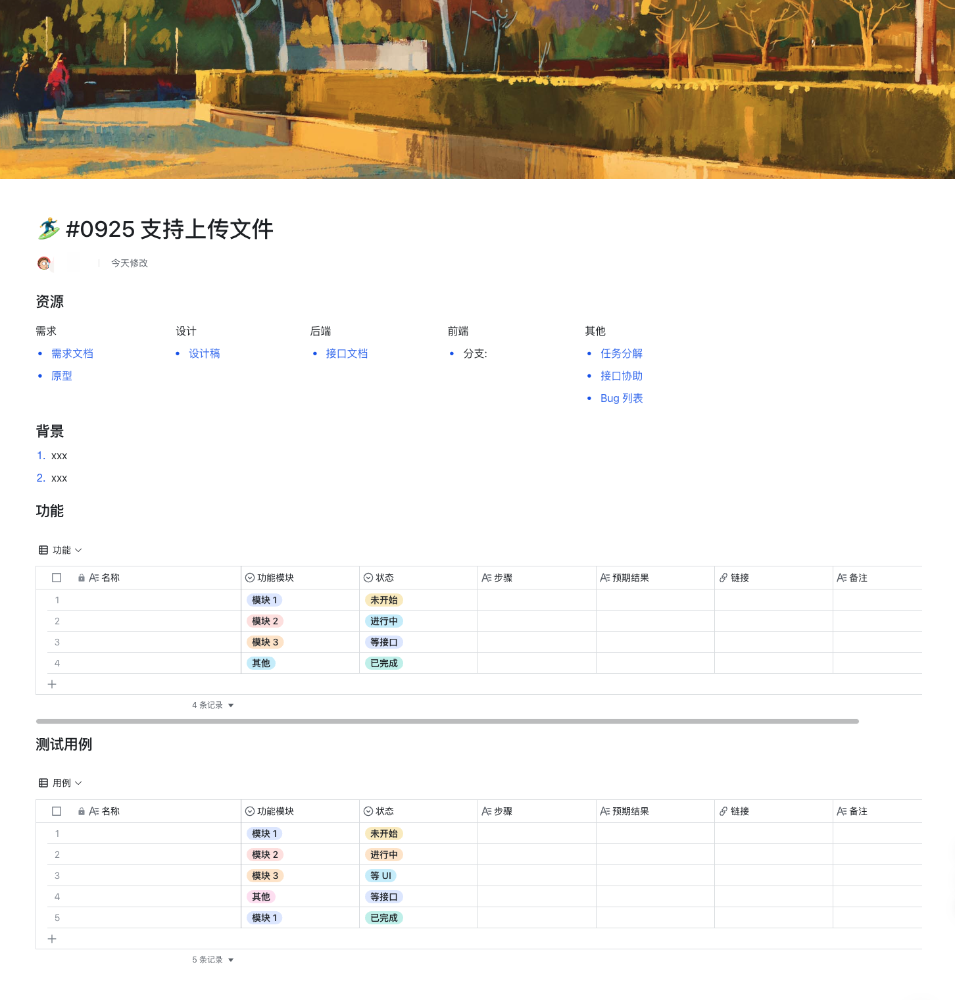

## 资源
放这个任务相关的资源的链接。这个可以用飞书的多列来减少占用的垂直空间。类似：

| 需求     | 设计     | 后端     | 前端     | 其他     |
| --------| -------- | --------| -------- | -------- |
| 需求文档 | 设计稿    | 接口文档  | 分支     | 任务分解 |
| 原型图   |          |         |          | 接口协助 |

## 背景
放该任务的背景信息。如存在 xx 问题。达成 xx 目标。

## TODO
放一些测试过程中，零碎的要做的。

1. todo1
2. todo2

## 功能
| 名称     | 模块     | 状态     |   内容    | 
| --------| -------- | --------| -------- |
|         | 模块1     | 未开始  |           | 
|         | 模块2     | 进行中  |           | 
|         | 模块3     | 阻塞中  |           | 
|         | 模块3     | 已完成  |           | 

## 测试用例
[测试用例模板](./test-case.md)
[接口问题协助](help-wanted-api.md)
