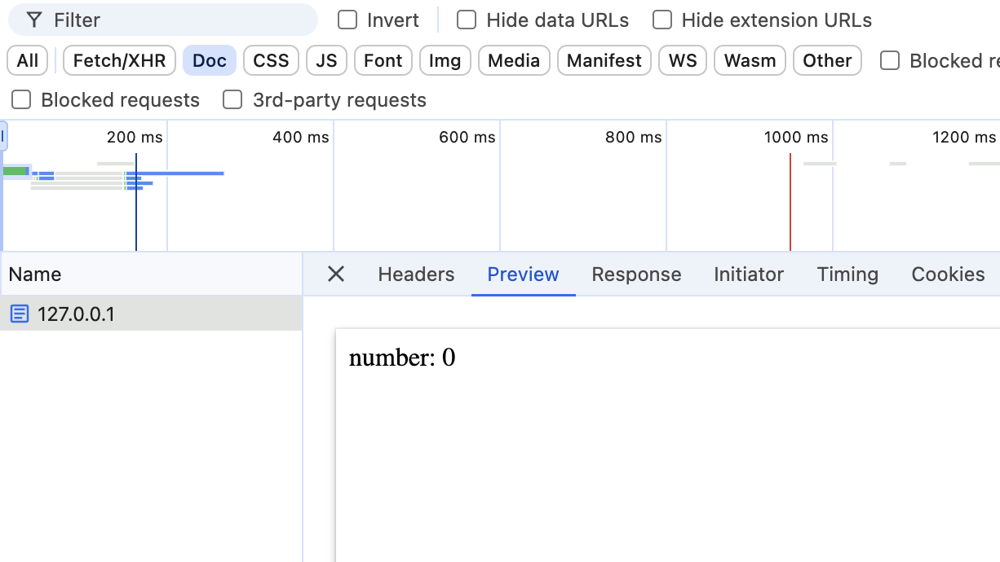

`Next.js` 的组件分为服务端组件(server-components)和客户端组件(client-components)。服务端组件只在服务端运行，运行完的结果直接输出到客户端。那么，客户端组件是只在客户端运行吗？

我们来看下面这个客户端组件：
```js
'use client'
import type { FC } from 'react'
import React, { useEffect } from 'react'

const Test: FC = () => {
  const [num, setNum] = React.useState(0)
  useEffect(() => {
    setNum(100)
  }, [])
  console.log(`number: ${num}`)

  return (
    <div>
      number: {num}
    </div>
  )
}
export default React.memo(Test)

``` 

服务端的输出结果是这样的：


在命令中也有 `console.log` 的信息：
```js
number: 0
```

客户端组件竟然也会在服务端执行并输出! [Next.js 官网文档](https://nextjs.org/docs/app/building-your-application/rendering/client-components#full-page-load)是这么说的：
```
Next.js will use React's APIs to render a static HTML preview on the server for both Client and Server Components. This means, when the user first visits your application, they will see the content of the page immediately, without having to wait for the client to download, parse, and execute the Client Component JavaScript bundle.
```

上面的说明简而言之就是：在服务端， `Next.js` 会用 `React` 的 `API` 来渲染客户端组件。 当然， `useEffect` 里的内容并不会在服务端执行。


因此，在 `Next.js` 中写客户端组件时要注意: 不要在非 `useEffect` 里直接用 `BOM` 相关的 `API`。比如，下面的写法都会报错：

```js
const name = window.name

return <div>{window.name}</div>
```

可以改成把调用 BOM 的 API 放到 `useEffect` 里:
```js
const [name, setName] = useState('')
useEffect(() => {
  setName(window.name)
}, [])
return <div>{name}</div>
```

也可以改成用 `globalThis` 来做判断:
```js
return <div>{globalThis.window && globalThis.window.name}</div>
```

希望这篇文章对你有所启发。如果觉得有用,别忘了点赞关注哦~
