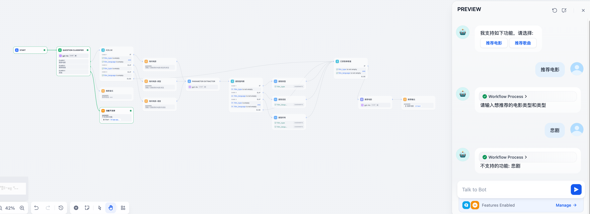
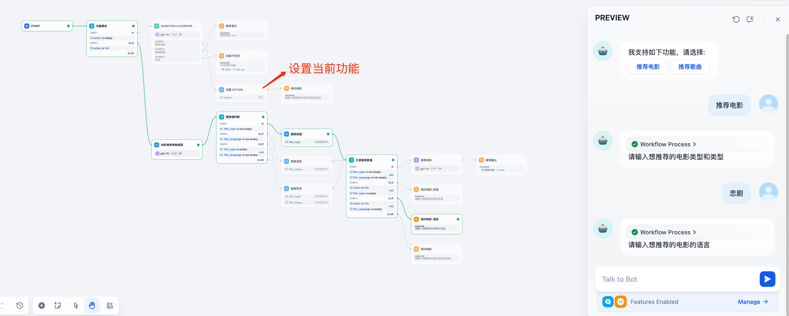
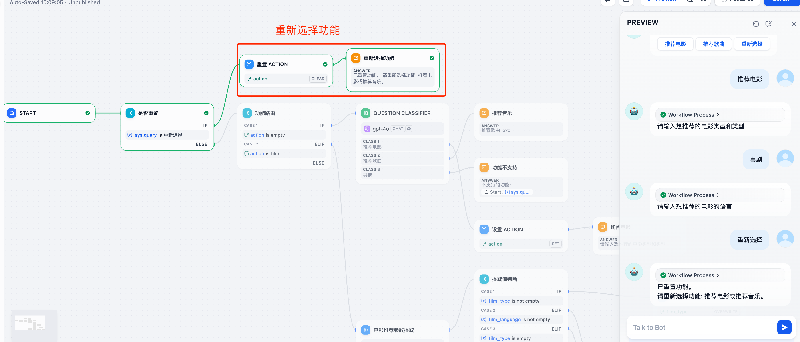

## 背景
在开发 Chatbot 时，通常需要实现多个功能，例如：
1. 推荐电影。
2. 推荐歌曲。

这些功能的调用往往需要额外的参数。例如，推荐电影时，需要用户提供电影类型和语言等信息。因此，Chatflow 的设计可能如下：  
1. 首先使用意图识别节点确定用户的需求。
2. 然后调用相应的功能。

然而，在测试中发现了问题：当用户第二次输入电影类型时，系统进入了意料之外的分支（功能不支持）。

## 问题分析
这是因为每次用户提问时，Chatflow 会重新进入初始流程。这可能导致进入错误的功能路由。

## 解决方案
要解决这个问题，可以通过**会话变量**记录用户上一次选择的功能，从而让 Chatflow 在多轮对话中保持状态一致性。改进后的 Chatflow 如下:  

在这个设计中，会话变量用于存储用户的功能选择。由于会话变量的值可以在多轮对话中共享，系统能够准确定位到用户的上次选择，从而实现预期的功能路由。

## 进一步优化
为了让用户能够灵活切换功能，可以在 Chatflow 中加入“重新选择功能”的节点。改进后的设计如下：  

通过这个功能，用户可以主动重置当前功能，系统会更新会话变量的值，重新进入相应的功能分支。这种设计既提升了灵活性，也增强了用户体验。

## 总结
在 Dify Chatflow 中，为了实现精准的功能路由：
1. 使用会话变量记录用户的功能选择；
2. 在设计中考虑多轮对话的状态共享；
3. 加入功能重置机制，提升系统的交互能力。

通过这些优化，Chatbot 可以更智能地响应用户需求，减少意外的路由错误，同时提供更人性化的交互体验。
