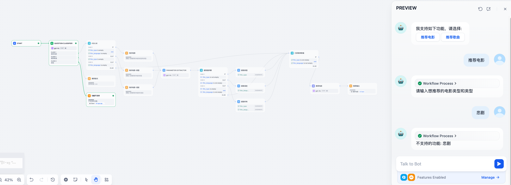

我们在做一个 Chatbot 会包含多个功能。比如支持:
1. 推荐电影。
2. 推荐歌曲。

在调用功能时又需要一些参数。比如推荐电影时，需要的参数有：电影的类型，语言。于是，我们可能会编排如下的 Chatflow: 先用一个意图识别节点来知道用户想做什么，然后调用对应功能。

然后发现当用户第二次回应电影类型时，进入了预期之外的分支：功能不支持。原因是，用户每一次提问，都会重头跑一次 Workflow，并不会记录上次提问进的分支。

要避免这种情况，让 Chatflow 进入预期的功能的方式是，用 **会话变量** 来记录用户的上次选的功能。如下图所示:

上面改动能生效的原因是：会话变量的值是在多轮对话中共享的。
